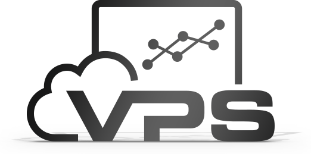

# `VPS`
VPS (Virtual Private Server) là dạng máy chủ ảo, server ảo được tạo ra bằng phương pháp phân chia một máy chủ vật lý thành nhiều máy chủ khác nhau có tính năng tương tự như máy chủ riêng (dedicated server), chạy dưới dạng chia sẻ tài nguyên từ máy chủ vật lý ban đầu đó. 

Mỗi VPS hosting là một hệ thống hoàn toàn riêng biệt, có một phần CPU riêng, dung lượng RAM riêng, dung lượng ổ HDD riêng, địa chỉ IP riêng và hệ điều hành riêng, người dùng có toàn quyền quản lý root và có thể restart lại hệ thống bất cứ lúc nào.

Nó an toàn hơn và ổn định hơn so với shared hositng vì bạn không phải chia sẽ không gian lưu trữ với người khác mà được dùng riêng. Và nó cũng rẻ hơn là thuê hẵn một server riêng.

## `Tác dụng VPS`
- Máy chủ game
- Lưu trữ website đa dịch vụ
- Phát triển platform: Ngày nay, sự phát triển của công nghệ trên điện thoại thông minh (Smart phone) hay máy tính bảng, các thiết bị di động thông minh ngày càng rộng rãi. 

Việc phát triển Platform (nền tảng) như hệ điều hành, ứng dụng trên hệ điều hành đều cần phải có một nơi tập trung để lưu trữ. Các APP thông dụng ngày nay mà bạn sử dụng trên điện thoại là một trong những ví dụ điển hình nhất.
- Máy chủ cho hệ thống email doanh nghiệp
- Chạy các chương trình truyền thông trực tiếp: Các chương trình truyền thông tuyến ngày nay cũng cần có nguồn lưu trữ thật tốt. Tuy không quá nhiều nhưng các loại dữ liệu lưu trữ luôn cần nhập và truy xuất liên tục.
## `Ưu/nhược của VPS`
- Ưu điểm:
     + Dễ dàng tùy biến nguồn tài nguyên, miễn là trong mức giới hạn của máy chủ vật lý cho phép.
     + Từ 1 máy chủ vật lý, có thể tạo ra nhiều máy chủ ảo. Tiết kiệm được tiền đầu tư phần cứng, tiền điện vận hành máy chủ, không gian lắp đặt…
     + Do nhiều máy chủ ảo có thể nằm tập trung trên 1 hệ thống máy chủ. Việc kiểm tra vận hành sẽ dễ dàng hơn.
- Nhược điểm:
     + Hoạt động bị ảnh hưởng bởi hoạt động và độ ổn định của máy chủ vật lý tạo ra VPS.
     + Việc sử dụng chung máy chủ vật lý khiến cho máy chủ ảo của bạn bị phụ thuộc.
     + Tốn thời gian và chi phí để nâng cấp tài nguyên và cũng không thể mở rộng nhiều.
     + Cách thức vận hành và năng suất hoạt động của máy chủ ảo không đạt được hiệu quả như mong muốn.
## `Cloud server`

Với cloud hosting, bạn không dùng duy nhất một server mà thay vào đó bạn sử dụng một cluster (cụm máy chủ) vận hành trên đám mây. Mỗi server trong một cluster chứa bản website mới nhất của bạn. Khi một server không hoạt động, cluster tự động chuyển hưởng traffic sang server còn lại. Nhờ vậy, cloud hosting không có thời gian downtime, vì luôn có server trong cluster có thể giải quyết yêu cầu từ khách truy cập.

## `Sự khác biệt giữa việc sử dụng máy chủ vật lý và Cloud Server`

## Máy chủ vật lý (Physical Servers):

- Máy chủ ảo chạy trên một máy chủ vật lý.
- Downtime thường xảy ra khi máy chủ vật lý gặp lỗi hoặc trong giờ cao điểm.
- Không đảm bảo tài nguyên phần cứng và có thể bị chia sẻ với người dùng khác.
- Mở rộng và thu hẹp tài nguyên cần thời gian và có giới hạn.

## Cloud Server:

- Tất cả các thành phần được thiết lập dự phòng và tự động thay thế khi hỏng, đảm bảo hoạt động 24/7.
- Tài nguyên phần cứng được đảm bảo và không chia sẻ với người dùng khác.
- Dễ dàng điều chỉnh cấu hình Cloud Server bất kỳ lúc nào.
- Cloud Server được xây dựng trên hạ tầng ảo hóa với công nghệ hàng đầu đảm bảo tốc độ và hiệu suất tối đa.