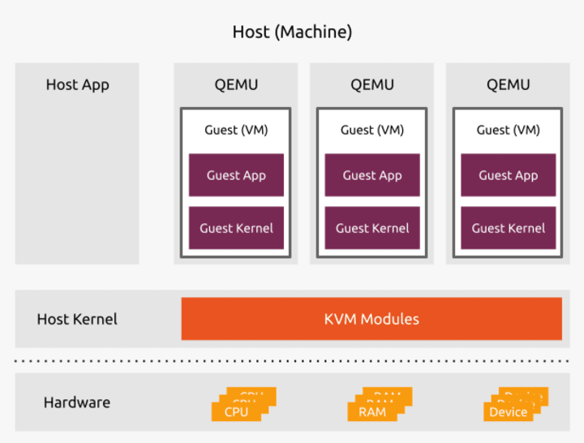

## `KVM`

1.`KVM là gì?`
    
- Máy ảo sử dụng nhân ( `Kernel Virtualization Machine` ) là một tính năng phần mềm có thể cài đặt trên máy tính vật lý chạy hệ điều hành Linux để tạo và quản lý các máy ảo.
- Máy ảo là một ứng dụng phần mềm, hoạt động như một máy tính độc lập, được chạy bên trong một máy tính vật lý khác. 
- Các máy ảo chia sẻ tài nguyên như CPU, băng thông mạng và bộ nhớ với máy vật lý.
- KVM đã được tích hợp và cung cấp trong các phiên bản phân phối Linux từ năm 2007.

2.`Ưu điểm`
- Hiệu năng cao.
- Bảo mật.
- Tính ổn định.
- Tiết kiệm chi phí.
- Tính linh hoạt

3.`So sánh KVM và VMware`

`VMware`
- VMware là công ty phần mềm sản xuất VMware ESXi, một giải pháp ảo hóa được cấp phép thương mại. 
- Phần mềm giám sát máy ảo của VMware được sử dụng trong ứng dụng dành cho doanh nghiệp, có các máy ảo sở hữu khả năng xử lý khối lượng công việc lớn.

`KVM`

- Máy ảo sử dụng nhân (KVM) và VMware ESXi đều mang đến cơ sở hạ tầng ảo hóa để triển khai các phần mềm giám sát máy ảo loại 1 trên nhân Linux.
- Tuy nhiên, KVM là một tính năng nguồn mở, còn VMware ESXi được cung cấp thông qua giấy phép thương mại.